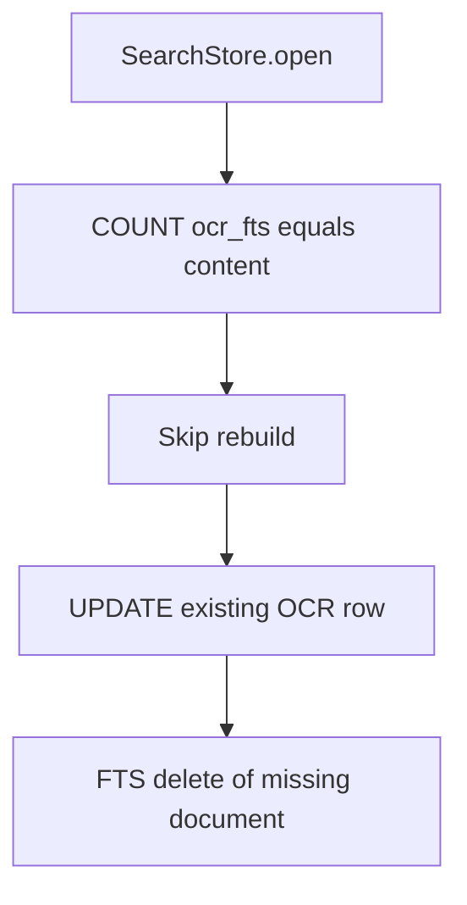

# Fix the malformed SQLite index

The file [`screenshots.ocr.sqlite`](C:\Users\pho\AppData\Local\screenshot-memory\Data\screenshots.ocr.sqlite) is intact: `PRAGMA quick_check` is ok, all 4,071 OCR rows are still there, and no vector row committed (`embedded_at` is null on every row). Indexing can continue after one FTS rebuild. Do not delete the file and do not run the 10,078-file index.

## Cause

[`SearchStore.syncFts`](src/core/search-store.ts) decides a rebuild is unnecessary when `COUNT(*)` from `ocr_fts` equals `COUNT(*)` from `ocr_text`. `ocr_fts` is an FTS5 external-content table, so that count is the content table, not the keyword index. On this database the real index (`ocr_fts_docsize`) has 3 rows and the content table has 4,071.

Those 4,071 rows were inserted before the FTS table existed. The skipped rebuild left them out of the index. The next `UPDATE` (upsert or `insertBatch`) runs the `ocr_text_au` trigger, which tells FTS5 to delete a document it never indexed. FTS5 reports that as `database disk image is malformed`, the batch rolls back, and the command stops. A temp database with one pre-FTS row reproduces it; `INSERT INTO ocr_fts(ocr_fts) VALUES('rebuild')` makes `insertBatch` and lexical search succeed.

## Change

In [`src/core/search-store.ts`](src/core/search-store.ts), compare `COUNT(*)` from `ocr_fts_docsize` with `COUNT(*)` from `ocr_text`. Rebuild when they differ. That runs once on the next index open and rewrites the keyword index from the stored text, including the 3 rows already indexed.

Add a regression in [`src/core/search-store.test.ts`](src/core/search-store.test.ts): insert a row through `OcrBackup` before `SearchStore` exists, open the store, and assert `insertBatch` commits, `ocr_fts_docsize` matches `ocr_text`, and a lexical query returns that row. Rebuild `dist/` so `ssm` picks it up.
