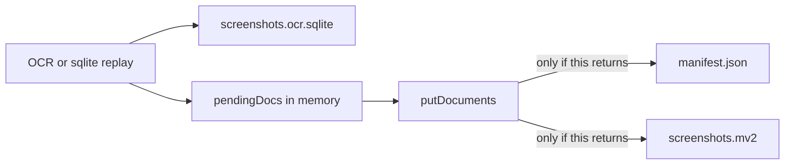

# Fix index resume after Ctrl+C

## What is broken

Resume does not look at the progress bar or at `ssm status`. At startup, [`indexDirectory`](src/core/indexer.ts) skips a file only when [`catalog.isUpToDate`](src/core/catalog.ts) says the path, mtime, and size are already in `screenshots.mv2.manifest.json`.

That manifest was last written at **7:31 AM**. The file list is 10,078 Dropbox screenshots, and only one of them is in that old catalog, which is the `1 already indexed` line.

Meanwhile the OCR backup is keeping up:

- [`screenshots.ocr.sqlite`](C:\Users\pho\AppData\Local\screenshot-memory\Data\screenshots.ocr.sqlite) has thousands of rows written after 7:31 AM (about 2,975 when checked, and the WAL was still growing).
- [`screenshots.mv2`](C:\Users\pho\AppData\Local\screenshot-memory\Data\screenshots.mv2) is still **54,151,144 bytes** (the 51.6 MB / 988 frames `ssm status` shows).
- The running process is `bun dist/cli.js index --files ...` (pid 19152, started 9:00:45 AM). `ssm` launches [`dist/cli.js`](dist/cli.js), not `src/`.

[`flushPendingDocs`](src/core/indexer.ts) saves the catalog only after `putDocuments` returns. Failures are `logger.debug` only, and the thrown `IndexError` happens at the end of the run. Ctrl+C never gets there. There is no `SIGINT` handler on `ssm index` (watch mode has one; index does not). `mv.seal()` also runs only at the end.

The 13 files/s restart is [`rememberMovedFile`](src/core/ocr-backup.ts): the catalog has no row, so the text is reused from SQLite and queued again. It still is not "already indexed" until the memvid flush succeeds.

## Why the flush does not succeed

[`putDocuments`](src/embeddings/ollama.ts) always tries memvid's built-in embedder first (`bge-small` from config). The installed SDK says local ONNX models are not available on Windows. The `.mv2` already contains `ollama` / `nomic` strings for the existing frames, and Ollama is running with `nomic-embed-text`.

The Ollama fallback runs only if that native `putMany` **throws**. On this machine the memvid file is not growing across long runs, so that first call is not returning (it hangs, or it fails and the error is hidden). Either way `catalog.save()` never runs, so the next start repeats the same files.

## Changes

1. **Use Ollama on Windows without calling the native embedder.** In [`src/embeddings/ollama.ts`](src/embeddings/ollama.ts), skip `putNativeBatch` when `process.platform === "win32"` and go straight to `putWithOllama` (`nomic-embed-text`, 768-d), which matches the vectors already stored. Keep the Mac native / CoreML split path as it is. Add a bun test next to the existing cases in [`src/embeddings/ollama.test.ts`](src/embeddings/ollama.test.ts).

2. **Commit each batch, and stop on a real flush error.** In [`src/core/indexer.ts`](src/core/indexer.ts):
   - Mark a file `indexed` in the catalog only after its batch is stored, not when it is queued. `empty` / `failed` can still be recorded immediately.
   - After a successful `putDocuments`, `catalog.save()`.
   - Then commit the `.mv2` so a later process sees the new frame count. `stats().frame_count` updates inside the same process before `seal()`, but `ssm status` is a new process. During implementation, check whether `seal()` leaves the handle writable; if it closes it, reopen through [`getMemory`](src/core/memory.ts) after each commit.
   - If `putDocuments` throws, print that error and abort the run. Do not keep OCRing for hours with the failure only in the debug log.

3. **Handle Ctrl+C.** In [`src/commands/index-cmd.ts`](src/commands/index-cmd.ts), on `SIGINT` and Windows `SIGBREAK`: stop scheduling new files, flush the partial batch, save the catalog, seal, close the OCR backup, exit 0. A hard kill can still drop the open batch; the per-batch commit in step 2 is what makes the completed batches survive that.

4. **Rebuild `dist/`.** [`ssm.ps1`](C:\Users\pho\.bun\bin\ssm.ps1) runs `dist/cli.js`. Run the project build so the installed command picks up the fix.

The current index process is still holding `screenshots.mv2`. Verification starts after that process is stopped. The SQLite backup should let the already-OCRed paths skip Tesseract; the first successful batch should move both the manifest mtime and the `ssm status` screenshot count, and a second `ssm index --files ...` after Ctrl+C should report those paths as already indexed.
