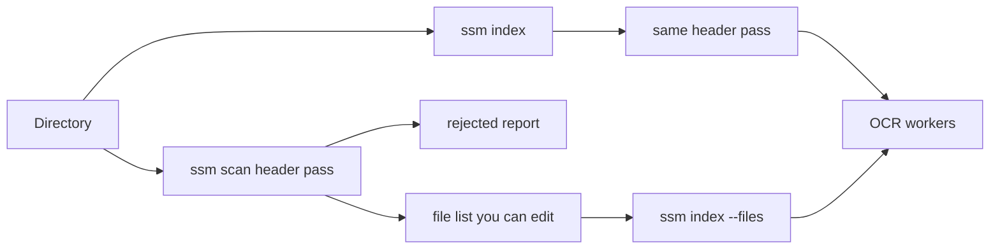

# Quiet OCR warnings and a fast file-list preflight

## What is actually happening

The lines `Image too small to scale!!` and `Line cannot be recognized!!` are printed by Leptonica/Tesseract inside `worker_threads`, via Emscripten’s `console.warn`. The filters in [`src/cli.ts`](src/cli.ts) and [`src/ocr/tesseract.ts`](src/ocr/tesseract.ts) only wrap the **main thread’s** `process.stderr.write`, so worker output still hits the terminal and collides with the `\r` progress line.

Those messages are warnings about a **1–2px text line inside** an image that already passed the 10px check (`MIN_IMAGE_DIMENSION` in [`src/utils/constants.ts`](src/utils/constants.ts)). Tesseract does not abort; it keeps running OCR. A header scan cannot predict them. It can only drop files that are unreadable or actually too small, in well under a minute for ~13k files, and it can decide **order** before the slow pass.

[`isValidImage`](src/ocr/preprocess.ts) already skips tiny files, but only inside an OCR worker slot, so they still sit in the same queue and the progress total includes them.

## 1. Capture worker stderr and print above the bar

Add a side-effect module imported **before** `tesseract.js` from [`src/ocr/tesseract.ts`](src/ocr/tesseract.ts) (ESM evaluates that import first). It replaces `worker_threads.Worker` so every Tesseract worker is constructed with `stderr: true` (and `stdout: true`), which stops inherited fd writes to the terminal.

- Give each engine worker its own job lock instead of the shared scheduler, so a stderr chunk can be tied to the path currently on that worker.
- Parse lines, ignore the existing noise set (DPI, msgtracer, these two warnings, and so on).
- Emit one deduped warning per file + message to a callback: `python_axgH75XcVq.png — Image too small to scale (2x36 vs min width of 3)`.
- [`ProgressTracker`](src/display/progress.ts) prints that line by clearing the current bar row, writing the warning, then redrawing the bar in place. These stay warnings, not failures.
- Remove the per-job `process.stderr.write` save/restore in `recognizeWithTimeout`. With 4 workers it restores the stream while other jobs are still printing, and it never saw worker output anyway.

Verify on Bun (`bin/ssm.cmd` launches Bun): `new Worker(path, { stderr: true })` must yield a readable `worker.stderr` and nothing on the console. If Bun ignores that flag, fall back to draining the worker stream another way before calling the approach done.

## 2. Fast preflight and an ordered file list

Shared helper, used by a new command and by a normal index:

- Read only `sharp` metadata (no decode, no OCR), with high concurrency.
- Accept when the file is a readable image and both sides are `>= 10` (flags can override).
- Reject with a reason: `unreadable` or `too-small` plus `WxH`.

**`ssm scan [directory]`**

- `--out <file>` writes accepted paths, one absolute path per line, in the chosen order.
- `--rejected <file>` writes `path<TAB>reason<TAB>detail`.
- `--sort newest|oldest|name|size` (default `newest`, so recent screenshots are first).
- `--min-width` / `--min-height`.
- Prints a short summary (accepted, rejected, seconds). No OCR.

**`ssm index`**

- `--files <list>` replaces the directory glob. Blank lines and `#` comments are ignored. Queue order is the file order (`p-limit` still runs `-w` jobs at a time, starting at the top of the list).
- Without `--files`, the same header check runs as its own phase **before** OCR. Rejected files are catalogued as `empty` (same as today’s skip) and are not part of the OCR total. Summary gets a line for how many were skipped as too small or unreadable.
- `--sort` applies when scanning a directory, same values as `scan`.

Editing the list (or deleting `python_*.png` rows) is the control for which images run, and in what order. The header pass will not skip a normal-sized screenshot that only fails on an internal 2px line; those still go through OCR, but the warning will sit above the bar with the filename instead of splitting it.
