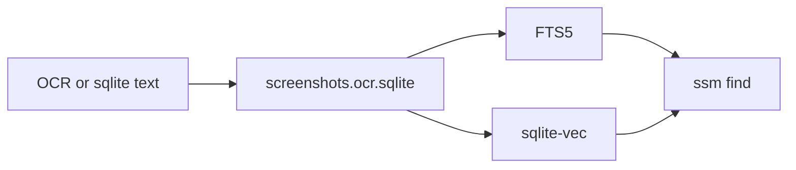

# Replace Memvid with SQLite search

Memvid stopped the index at 54.2 MB because of its 50 MB free tier. The OCR text is already in [`screenshots.ocr.sqlite`](src/core/ocr-backup.ts). That file becomes the search index: FTS5 for `lex`, sqlite-vec for `sem`, and reciprocal rank fusion for `auto`. Embeddings stay on the local Ollama model `nomic-embed-text` (768-d). `@memvid/sdk` is removed, so nothing calls memvid.com.

## Store

Add [`src/core/search-store.ts`](src/core/search-store.ts) and open the same file as [`ocrBackupPath`](src/core/ocr-backup.ts) on one connection (WAL). Extend `ocr_text` with `tags` (JSON), `width`, `height`, and `embedded_at`. Add:

- `ocr_fts` as an FTS5 external-content table on `ocr_text.rowid`, with insert/update/delete triggers
- `vec_screenshots` via sqlite-vec `vec0` (`float[768]`), keyed by that rowid
- `index_meta` recording the embedding model and dimension

Load the extension with the `sqlite-vec` package (`load` / `getLoadablePath`) on both `bun:sqlite` and `node:sqlite`. If FTS5 or the extension fails to load, throw a clear error at open instead of indexing into a store that cannot be searched.

`OcrBackup` keeps path/hash lookup. `SearchStore` owns the shared connection, text upsert, vector insert, search, previews, and stats. A batch commits in one transaction: upsert text, insert the vector, set `embedded_at`. There is no `seal()`.

## Indexing

In [`src/core/indexer.ts`](src/core/indexer.ts), drop `getMemory`, `createMemory`, and `mv.seal()`. A file is skipped only when the catalog is up to date **and** `embedded_at` is set. Catalog rows from the old Memvid index (about 886) are not skipped just because the manifest says `indexed`; if they have no vector they are queued again. When SQLite already has the text, the existing `rememberMovedFile` path embeds it and does not run Tesseract.

Each batch calls `getLocalEmbedder().embedDocuments` and then `SearchStore.insertBatch`. The catalog is saved only after that transaction commits. Ctrl+C still flushes the open batch. `--force` clears the catalog and the vector rows, then reprocesses files.

Delete the Memvid backfill (`backfillOcrBackup` / `backfillOcrBackupFile`). Leave the existing `.mv2` on disk unused. Texts already in SQLite are the migration; anything missing is OCR'd on the next index.

[`src/embeddings/ollama.ts`](src/embeddings/ollama.ts) keeps `OllamaEmbeddings` and drops `putDocuments`, native `putMany`, CoreML batch splitting, and the Memvid types. Every platform embeds with Ollama. `ssm.ps1` already sets `OLLAMA_HOST` to `http://127.0.0.1:11434`, where `nomic-embed-text` is installed.

## Search, browse, status

[`src/core/searcher.ts`](src/core/searcher.ts) reads `SearchStore` and still returns `SearchHit`:

- `lex`: FTS5 `MATCH`, `bm25()`, `snippet()`
- `sem`: cosine KNN in sqlite-vec, query embedded with Ollama
- `auto`: both lists merged with reciprocal rank fusion (k = 60), then the existing `minRelevancy` cutoff
- `searchWithContext`: the same search, then the stored full text up to `contextChars`

[`src/commands/browse.ts`](src/commands/browse.ts) loads previews with `substr(text)` and full text with `SELECT text`. [`src/core/memory.ts`](src/core/memory.ts) becomes existence plus stats over the SQLite file (document count, file size, lex present, vec present). `ssm status` shows that SQLite path. [`src/cli.ts`](src/cli.ts) treats the SQLite file as the index.

## Remove Memvid and test

Remove `@memvid/sdk` from [`package.json`](package.json) and add `sqlite-vec`. Update the Memvid sentences in [`README.md`](README.md) (the `.mv2` storage line and the semantic-search bullet) so they describe the local SQLite index. Rebuild `dist/`.

Tests:

- Rank fusion is a pure function (no database)
- Temp database: FTS match returns a snippet, vector insert plus KNN returns the nearer row, and a committed row is still there after reopen
- Existing OCR backup tests still pass

Do not index the 10,078-file list during implementation. After the change, `ssm index --files ...` embeds rows already in SQLite and is no longer capped at 50 MB.
