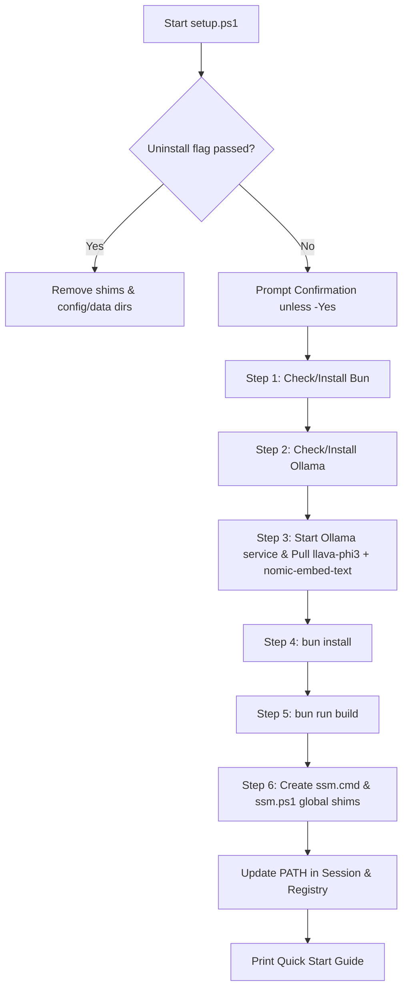

# Implementation Plan - Windows `setup.ps1` for screenshot-memory

Port the complete functionality of [setup.sh](file:///c:/Users/pho/repos/PHO_EXPLORATION/screenshot-memory/setup.sh) to native PowerShell for Windows ([setup.ps1](file:///c:/Users/pho/repos/PHO_EXPLORATION/screenshot-memory/setup.ps1)), ensuring seamless setup and operation on Windows 10/11 with both Windows PowerShell 5.1 and PowerShell 7+ (`pwsh`).

## Goal Description
The `screenshot-memory` repository currently provides [setup.sh](file:///c:/Users/pho/repos/PHO_EXPLORATION/screenshot-memory/setup.sh) tailored for macOS and Linux (with partial bash Windows handling). Windows users need a native PowerShell setup script ([setup.ps1](file:///c:/Users/pho/repos/PHO_EXPLORATION/screenshot-memory/setup.ps1)) that executes all equivalent steps:
1. **Uninstallation**: Remove global command shims, cache, data, and configuration files.
2. **Environment verification**: Detect and install [Bun](https://bun.sh) and [Ollama](https://ollama.com) on Windows if missing.
3. **PATH configuration**: Ensure user PATH and current session PATH contain Bun and Ollama.
4. **Service & Model management**: Start Ollama in the background (if not already running) and pull required vision (`llava-phi3`) and embedding (`nomic-embed-text`) models.
5. **Project build**: Run `bun install` and `bun run build`.
6. **Global command setup**: Generate `ssm.cmd` and `ssm.ps1` wrappers in the user's global bin directory (e.g. `~/.bun/bin`) pointing to `dist/cli.js`, ensuring `ssm` is directly invokable from PowerShell, Command Prompt, and Windows Terminal.
7. **Local wrappers**: Provide `bin/ssm.cmd` and `bin/ssm.ps1` for direct repository invocation.

---

## User Review Required

> [!IMPORTANT]
> **Global Command Mechanism on Windows**:
> Unlike Unix symlinks (`ln -s`), Windows commands are resolved via `PATHEXT` (`.cmd`, `.ps1`, `.exe`). `setup.ps1` will generate:
> 1. `ssm.cmd` (batch wrapper for `cmd.exe`, PowerShell, and third-party tools)
> 2. `ssm.ps1` (PowerShell wrapper for native argument passing)
> 3. `screenshot-memory.cmd` / `screenshot-memory.ps1` (full name aliases)
> Target location will be `$env:USERPROFILE\.bun\bin` (standard for Bun) with fallback to `$env:USERPROFILE\.local\bin` or `$env:USERPROFILE\bin`.

> [!NOTE]
> **Gitflow Branching**:
> In accordance with repository workflow rules, execution will branch from `develop` into `feature/windows-setup-script`.

---

## Open Questions

None currently blocking. Default paths and configurations adhere directly to `src/utils/paths.ts` and `setup.sh`.

---

## Proposed Changes



### Windows Setup & Command Wrappers

#### [NEW] `setup.ps1`
Path: [setup.ps1](file:///c:/Users/pho/repos/PHO_EXPLORATION/screenshot-memory/setup.ps1)

Script implementation details:
- **Parameter signature**:
  ```powershell
  [CmdletBinding(DefaultParameterSetName = 'Install')]
  param(
      [Parameter(ParameterSetName = 'Uninstall')]
      [Alias('r')]
      [switch]$Remove,

      [Parameter(ParameterSetName = 'Uninstall')]
      [switch]$Uninstall,

      [Parameter(ParameterSetName = 'Install')]
      [Alias('y')]
      [switch]$Yes,

      [Parameter(ParameterSetName = 'Install')]
      [switch]$SkipModelDownload
  )
  ```
  Also checks `$args` for `--remove`, `--uninstall`, `-r`, `--yes`, `-y` for seamless compatibility with Unix-style invocation (`.\setup.ps1 --remove`).

- **Formatting & Color functions**:
  - `print_header`, `print_step`, `print_success`, `print_warning`, `print_error`, `print_info` with cyan borders and colorized status icons matching `setup.sh`.

- **Uninstall logic**:
  - Removes shims from `$env:USERPROFILE\.bun\bin\ssm*`, `$env:USERPROFILE\.bun\bin\screenshot-memory*`, `$env:USERPROFILE\.local\bin\ssm*`, `$env:USERPROFILE\bin\ssm*`.
  - Removes Windows data & config:
    - Data & cache: `$env:LOCALAPPDATA\screenshot-memory`
    - Config: `$env:APPDATA\screenshot-memory`
    - Conf storage: `$env:APPDATA\screenshot-memory-nodejs`
    - Cross-platform config: `$env:USERPROFILE\.config\screenshot-memory`

- **Step 1 - Bun**:
  - Checks `Get-Command bun` or presence in `$env:USERPROFILE\.bun\bin\bun.exe`.
  - If missing: executes official installer `irm bun.sh/install.ps1 | iex` with `winget install Oven-sh.Bun` fallback.
  - Ensures `$env:USERPROFILE\.bun\bin` is added to `$env:Path` and persistent User `Path`.

- **Step 2 - Ollama**:
  - Checks `Get-Command ollama` or presence in `$env:LOCALAPPDATA\Programs\Ollama\ollama.exe`.
  - If missing: installs via `winget install Ollama.Ollama --accept-source-agreements --accept-package-agreements` or downloads `OllamaSetup.exe` installer.
  - Updates `$env:Path` and persistent User `Path`.

- **Step 3 - Ollama Service & Models**:
  - Tests `http://localhost:11434/api/tags` via `Invoke-RestMethod`.
  - If not responding, starts `$env:LOCALAPPDATA\Programs\Ollama\ollama app.exe` or `Start-Process ollama -ArgumentList "serve" -WindowStyle Hidden`.
  - Polls up to 30s until ready.
  - Checks installed models:
    - Vision model: checks `llava-phi3`, `llava-phi3:latest`, `llava:7b`, `smolvlm2`. If missing, runs `ollama pull llava-phi3`.
    - Embedding model: checks `nomic-embed-text`, `nomic-embed-text:latest`. If missing, runs `ollama pull nomic-embed-text`.

- **Step 4 - Dependencies**:
  - Runs `bun install`.

- **Step 5 - Build**:
  - Runs `bun run build`.

- **Step 6 - Global Command**:
  - Locates or creates target bin folder (`$env:USERPROFILE\.bun\bin`).
  - Generates:
    - `ssm.cmd` and `screenshot-memory.cmd`:
      ```cmd
      @echo off
      bun "<RepoPath>\dist\cli.js" %*
      ```
    - `ssm.ps1` and `screenshot-memory.ps1`:
      ```powershell
      & bun "<RepoPath>\dist\cli.js" @args
      ```
  - Also attempts symlink / bash shim `ssm` for Git Bash / MSYS2 compatibility.
  - Verifies target bin directory is in User `Path` registry and current session `$env:Path`.

- **Completion output**:
  - Outputs the Quick Start guide with Windows screenshots directory (`$env:USERPROFILE\Pictures\Screenshots`).

---

#### [NEW] `bin/ssm.cmd` & `bin/ssm.ps1`
Paths: [bin/ssm.cmd](file:///c:/Users/pho/repos/PHO_EXPLORATION/screenshot-memory/bin/ssm.cmd), [bin/ssm.ps1](file:///c:/Users/pho/repos/PHO_EXPLORATION/screenshot-memory/bin/ssm.ps1)

- Relative wrappers inside the repository's `bin/` directory allowing developers to run `.\bin\ssm` or `.\bin\ssm.cmd` directly from the repo root without global install.

---

#### [MODIFY] `README.md`
Path: [README.md](file:///c:/Users/pho/repos/PHO_EXPLORATION/screenshot-memory/README.md)

- Update **Install** section to document both Linux/macOS (`./setup.sh`) and Windows (`.\setup.ps1`):
  ```markdown
  ### Windows (PowerShell)
  ```powershell
  git clone https://github.com/memvid/screenshot-memory.git
  cd screenshot-memory
  .\setup.ps1
  ```
  ```

---

## Verification Plan

### Automated Tests
1. **Script Syntax & Parser Check**:
   ```powershell
   pwsh -Command "[System.Management.Automation.Language.Parser]::ParseFile((Resolve-Path '.\setup.ps1'), [ref]$null, [ref]$null)"
   ```
2. **Uninstall Dry-Run / Test**:
   ```powershell
   pwsh -ExecutionPolicy Bypass -File .\setup.ps1 -Remove
   ```
3. **Fresh Setup Execution**:
   ```powershell
   pwsh -ExecutionPolicy Bypass -File .\setup.ps1 -Yes
   ```
4. **Build Verification**:
   Verify `dist/cli.js` exists and is updated.
5. **CLI Functional Execution**:
   - `ssm --version`
   - `ssm --help`
   - `ssm ocr ./examples/stripe.png`
   - `ssm stats`

### Manual Verification
- Launch a new PowerShell or CMD terminal window and verify `ssm` command is immediately recognized and runnable globally.
- Verify `ssm find "stripe"` against indexed example screenshots.
